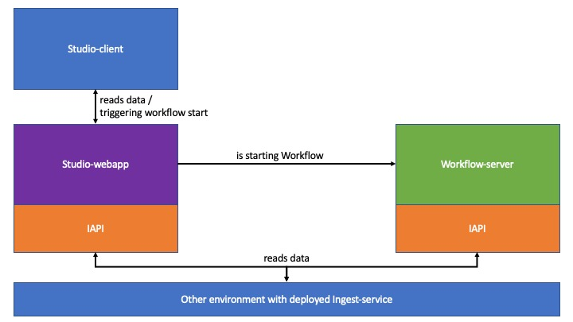
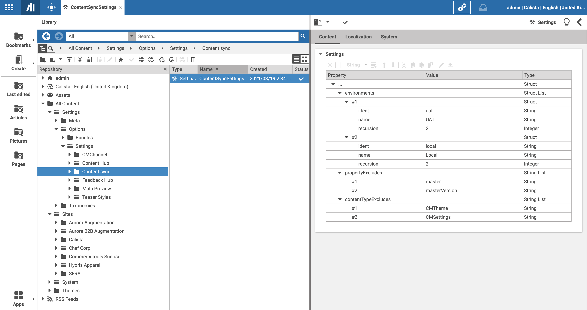
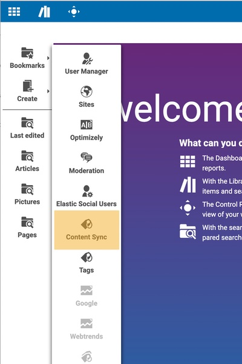
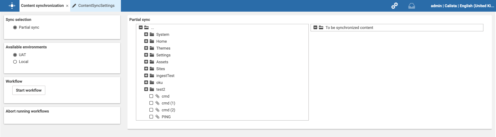
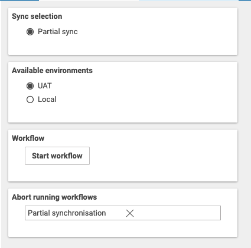

# Editorial Quick Start

--------------------------------------------------------------------------------

\[[Up](README.md)\] \[[Top](#top)\]

--------------------------------------------------------------------------------

## Introducing

The _content-sync-example_ repository is offering the ability to synchronize content between environments. 
The extension is explicitly for cloud customers.
Please note that _content-sync-example_ is, as the name is suggesting, only ought to be an example on
how a sync can be implemented, and is only covering the use case of a partial sync (partial sync is describing 
the functionality to synchronize only a limited amount of contents, and not a whole environment).

## Purpose
As mentioned in the introduction, the *content-sync-example* project is only offering a partial sync, but with
extension points for customizations. Such a customization can be:
- Implementation of a complete environment synchronization
- Implementation for all sites of a given customer

## Details of Operations & Limitations

* For each remote content to be synchronized, a local content is created or an already existing local content
  at the same repository path is updated. The synchronization checks for matching content types in that case
  and skips the content, if types do not match.
* For each outgoing content reference (link list, markup, struct) in a content which is to be synchronized, a reference to a local
  content is created, if a local content with the correct path exists. The synchronization checks for matching content types in that case and removes the reference, if types do not match. Links between contents of
  the selected synchronization set are kept accordingly, of course.
* No content except those selected for synchronization are created locally. If outgoing references have
  no corresponding local content, the reference will be removed (see above).
* With current configuration, the synchronization app is only available to members of group
_Administratoren_. Synchronized contents will show user _workflow_ as last editor.
* Property _masterVersion_ of all content types is ignored during synchronization since it is a complex task to update it according to user's intention. Localization workflows may thus break or behave unexpectedly due to missing or not updated master versions.

## Contrib
Please feel free to contribute your functionality! Contribution can be achieved by Pull Requests.

## Overview

## Necessary and preliminary data
To configure the content sync correctly, it is necessary to have the following data in place:
- URL to the _Ingest Service_.
- JWT token for the Ingest Service. In case you haven't received the JWT token yet, please create a support ticket asking for that token (support@coremedia.com).

## Content-sync-example architecture
The content-sync architecture is quite simple and inside this git repository, the following application extensions can found:
- studio-client: Extension for CoreMedia Studio offering a simple and extendable UI.
- studio-server: CoreMedia Studio server extension. Providing the communication interfaces (retrieval of ingest-service data plus WFS communication).
- workflow-server: Additional CoreMedia Workflow to execute the workflow.

The picture below is depicting the high-level architecture: 

## Studio-server configuration

## Studio-client configuration
In Studio, it is necessary to create a new Settings document inside the folder:
* /Options/Settings/Content Sync/ContentSyncSettings

The following entries needs to be present:

- Top-level element is named **"environments"** and is of type "StructList"
- Below the StructList with name **environments** it is necessary to add one struct per environment

Each Struct (which is representing an environment) has the following entries:

- ident (identifier which is the same used as in the studio-server configuration)
- name (Name which should be displayed in the CoreMedia Studio interface)
- recursion (Number indicating how many sub-references should be resolved. 1 is the default)

As an addition, it is possible to define filters for:

- Property names
- Content types

which are in general ignored, even for the references.
To add filtering options, the following configuration can be made:

- Add a new StringList called **propertyExcludes** to the root. Once done, each entry is representing the property name which should be excluded.
- Add a new StringList called **contentTypeExcludes** to the root. Once done, each entry is representing the content type to be excluded.

The picture below is showing an example:

## Interface
The Content-sync-example can be (after the extension was correctly set-up) started in CoreMedia Studio by simply opening the "Apps"-Menu,  
and next by a single click on the Content Sync button. The Picture below is showing the button inside the Apps menu.

Intentionally, the next step is to click on button _Content Sync_ and once done, the content-sync editor is opening. Per default, the first
environment in the configured list is selected as active.

### Left column
The column on the left is basically displaying all configuration options and actions. 

#### Collapsible panel 1
Overview of all configured synchronization options. Please note that it is possible to add custom sync types e.g site-synchronization ... 

#### Collapsible panel 2
Overview of all configured environments. This panel is reflecting the settings.

#### Collapsible panel 3
This panel is providing the button to execute the workflow. If clicked, a workflow for the current synchronization set
is started and an entry is added to the list in _panel 4_ (see next section).

#### Collapsible panel 4
Once a workflow is started or there are already running synchronization workflows, those are displayed with the typename.
Each workflow displayed in this panel can be ***aborted***. If the workflow terminates, the entry also disappears.

As mentioned in the configuration section, it is also possible to configure ***exclusions*** where each exclusion
- property exclusion
- content-type exclusion

will appear as separate Collapsible panel. The picture below is showing the panels.

